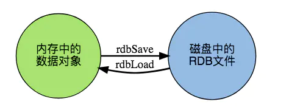
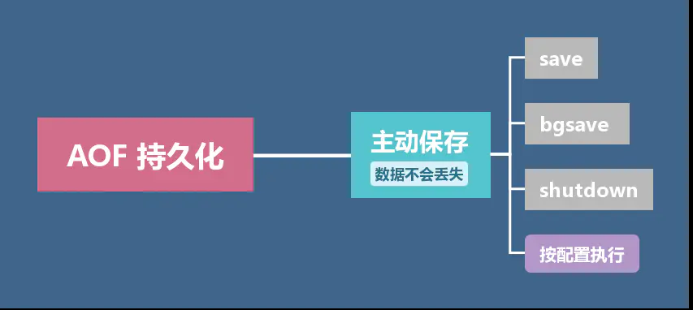
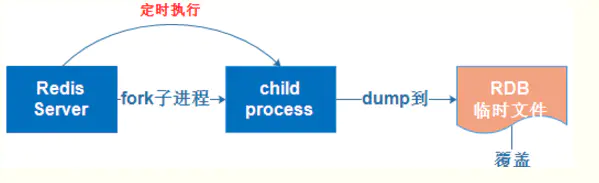
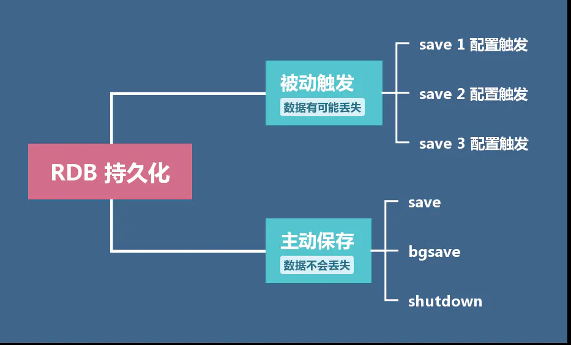
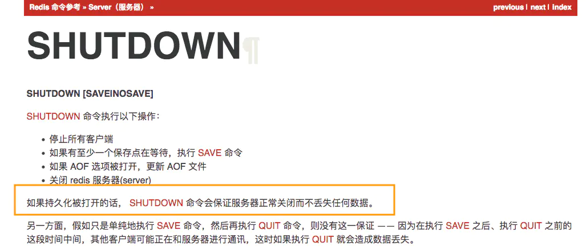
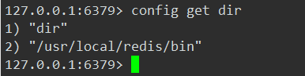

# Redis持久化

## 一、什么叫持久化？
将数据（如内存中的对象）保存到可永久保存的存储设备中。 
持久化的主要应用是将内存中的对象存储在数据库中，或者存储在磁盘文件中、 XML 数据文件中等等。 

也可以从应用层和系统层这两个层面来理解持久化： 
>应用层：如果关闭( Close )你的应用然后重新启动则先前的数据依然存在。 
>系统层：如果关闭( Shutdown )你的系统（电脑）然后重新启动则先前的数据依然存在。 

## 二、Redis为什么要持久化？
Redis 中的数据类型都支持 push/pop、add/remove 及取交集并集和差集及更丰富的操作，而且这些操作都是原子性操作。在此基础上，Redis 支持各种不同方式的排序。与 Memcached 一样，为了保证效率，数据都是缓存在内存中。 

由于数据都是缓存在内存中的，当你重启系统或者关闭系统后，缓存在内存中的数据都会消失殆尽，再也找不回来了。所以，为了让数据能够长期保存，就要将 Redis 放在缓存中的数据做持久化存储。 

## 三、Redis怎么实现持久化？
### 1、RDB和AOF两种方法实现持久化。
RDB持久化方式能够在指定的时间间隔能对你的数据进行快照存储。 
AOF持久化方式记录每次对服务器写的操作，当服务器重启的时候会重新执行这些命令来恢复原始的数据，AOF命令以redis协议追加保存每次写的操作到文件末尾。Redis还能对AOF文件进行后台重写,使得AOF文件的体积不至于过大。 
### 2、RDB 和AOF方式的优缺点
#### 1）RDB 方式的优缺点

优点 
>* 方便的数据备份和数据恢复：RDB 是一个非常紧凑的文件，它保存了某个时间点的数据集，非常适用于数据集的备份。比如你可以在每个小时报保存一下过去24小时内的数据，同时每天保存过去30天的数据，这样即使出了问题你也可以根据需求恢复到不同版本的数据集。 
>* 方便传输：RDB 是一个紧凑的单一文件，很方便传送到另一个远端数据中心，非常适用于灾难恢复。 
>* 最大化 Redis 的性能：RDB 在保存 RDB 文件时父进程唯一需要做的就是 fork 出一个子进程，接下来的工作全部由子进程来做，父进程不需要再做其他 IO 操作，所以 RDB 持久化方式可以最大化 Redis 的性能。 

缺点 
>* RDB 由于备份频率不高，所以在回复数据的时候有可能丢失一小段时间的数据，而且在数据集比较大的时候有可能对毫秒级的请求产生影响。 
>* 如果希望在 Redis 意外停止工作（例如电源中断）的情况下丢失的数据最少的话，那么不适合使用RDB。Redis 要完整的保存整个数据集是一个比较繁重的工作，比如设置每隔5分钟或者更久做一次完整的保存，万一 Redis 意外宕机，则可能会丢失几分钟的数据。 
>* RDB 需要经常 fork 子进程来保存数据集到硬盘上,当数据集比较大的时候，fork 的过程是非常耗时的，可能会导致 Redis 在一些毫秒级内不能响应客户端的请求。如果数据集巨大并且 CPU 性能不是很好的情况下，这种情况会持续1秒。 
>>AOF 也需要 fork，但是你可以调节重写日志文件的频率来提高数据集的耐久度。 

#### 2）AOF 方式的优缺点

优点 
>* 不同的 fsync 策略：你可以使用不同的 fsync 策略：无 fsync、每秒 fsync 、每次写的时候 fsync 。使用默认的每秒 fsync 策略, Redis 的性能依然很好( fsync 是由后台线程进行处理的,主线程会尽力处理客户端请求),一旦出现故障，你最多丢失1秒的数据。 
>* 只进行追加的日志文件：AOF文件是一个只进行追加的日志文件，即使由于某些原因(磁盘空间已满，写的过程中宕机等等)未执行完整的写入命令，你也也可使用redis-check-aof工具修复这些问题。 
>* 因为采用了追加方式，如果不做任何处理的话，AOF文件会变得越来越大，为此，redis提供了AOF文件重写（rewrite）机制，即当AOF文件的大小超过所设定的阈值时，redis就会启动AOF文件的内容压缩，只保留可以恢复数据的最小指令集。  

整个重写操作是绝对安全的，因为 Redis 在创建新 AOF 文件的过程中，会继续将命令追加到现有的 AOF 文件里面，即使重写过程中发生停机，现有的 AOF 文件也不会丢失。 而一旦新 AOF 文件创建完毕，Redis 就会从旧 AOF 文件切换到新 AOF 文件，并开始对新 AOF 文件进行追加操作。 

数据恢复更完整：利用AOF 文件进行数据恢复。AOF 文件有序地保存了对数据库执行的所有写入操作， 这些写入操作以 Redis 协议的格式保存， 因此 AOF 文件的内容非常容易被人读懂， 对文件进行分析（parse）也很轻松， 导出（export） AOF 文件也非常简单。 

举个例子， 如果你不小心执行了 FLUSHALL 命令， 但只要 AOF 文件未被重写， 那么只要停止服务器， 移除 AOF 文件末尾的 FLUSHALL 命令， 并重启 Redis ， 就可以将数据集恢复到 FLUSHALL 执行之前的状态。 

缺点
>* AOF 的文件比较大，而且由于保存频率很高，所以整体的速度会比 RDB 慢一些，但是性能依旧很高。 
>* AOF 文件的体积通常要大于 RDB 文件的体积。 
>* 根据所使用的 fsync 策略，AOF 的速度可能会慢于 RDB 。 在一般情况下， 每秒 fsync 的性能依然非常高， 而关闭 fsync 可以让 AOF 的速度和 RDB 一样快， 即使在高负荷之下也是如此。 不过在处理巨大的写入载入时，RDB 可以提供更有保证的最大延迟时间（latency）。 

#### 总结
如果需要进行大规模数据的恢复，且对于数据恢复的完整性不是非常敏感，那RDB方式要比AOF方式更加的高效。 

### 3、RDB和AOF工作原理
RDB 

AOF 

## 四、RDB 和AOF方式持久化的开启与配置
### 1、RDB 方式持久化的开启与配置
#### 1）Redis 默认持久化方式：

RDB ，并且默认是打开的。 
RDB记录文件：dump.rdb。 
#### 2）RDB 的保存方式分为主动保存与被动保存：
* 主动保存 
Redis 提供了save和bgsave这两种不同的保存方式，并且这两个方式在执行的时候都会调用rdbSave函数，但它们调用的方式各有不同。 
save阻塞主进程，bgsave不会阻塞主进程。 

| 保存方式 |   |
|---|---|
| save | 直接调用 rdbSave方法 ，阻塞 Redis 主进程，直到保存完成为止。在主进程阻塞期间，服务器不能处理客户端的任何请求。 |
| bgsave | fork 出一个子进程，子进程负责调用 rdbSave ，并在保存完成之后向主进程发送信号，通知保存已完成。因为 rdbSave 在子进程被调用，所以 Redis 服务器在 bgsave 执行期间仍然可以继续处理客户端的请求。 |

>save 是同步操作，bgsave 是异步操作。 

在持久化被打开的情况下，通过shutdown命令关闭也不会丢失数据。 

	
* 被动保存 
	需要满足配置文件中设定的触发条件，目前官方默认的触发条件可以在 redis.conf 中看到： 
	
  
	其含义为： 
	>服务器在900秒之内，对数据库进行了至少1次修改 
	>服务器在300秒之内，对数据库进行了至少10次修改。 
	>服务器在60秒之内，对数据库进行了至少10000次修改。 
	
	满足触发条件后，数据就会被保存为快照。（正是因为这样才说 RDB 的数据完整性是比不上 AOF 的。） 

	触发保存条件后，会在指定的目录生成一个名为 dump.rdb 的文件，等到下一次启动 Redis 时，Redis 会去读取该目录下的 dump.rdb 文件，将里面的数据恢复到 Redis。（该目录在客户端中输入命令config get dir查看） 
	

#### 3）关闭RDB
在redis.conf 注解掉save那三行，然后保存配置文件重新启动 Redis 服务，RDB关闭。 

### 2、AOF 方式持久化的开启与配置

AOF持久化通用可以使用save、bgsave、shutdown三种主动保存方式，也以直接按照配置文件执行。 
* 按配置执行 
>1）开启AOF方式持久化 
    通过redis.conf 配置文件开启AOF：appendonly yes 
>2）设置AOF同步方式 
    在redis.conf 配置文件中设置同步方式： 

| 同步方式 |  |
|---|---|
| appendfsync always | 每次有数据修改发生时都会写入AOF文件（安全但是费时）。 |
| appendfsync everysec | 每秒钟同步一次，该策略为AOF的缺省策略。 |
| appendfsync no | 从不同步。高效但是数据不会被持久化。 |

>3） AOF 记录文件 
    AOF 记录文件默认文件名为appendonly.aof，文件名可以更改，在配置中显示为：appendfilename "appendonly.aof" 
>4）完成上三步后重启Redis服务 
	
### 3、RDB不重启切换到AOF
在 Redis 2.2 或以上版本，可以在不重启的情况下，从 RDB 切换到 AOF 。 
为最新的 dump.rdb 文件创建一个备份、将备份放到一个安全的地方。 
执行以下两条命令: 

| 命令 | 功能 |
|---|---|
| redis-cli config set appendonly yes | 开启AOF功能，Redis 会阻塞直到初始 AOF 文件创建完成为止，之后 Redis 会继续处理命令请求， 并开始将写入命令追加到 AOF 文件末尾。 |
| redis-cli config set save  "" | 关闭RDB功能。 这一步是可选的， 如果你愿意的话， 也可以同时使用 RDB 和 AOF 这两种持久化功能。 |

确保写命令会被正确地追加到 AOF 文件的末尾。 

重要：别忘了在 redis.conf 中打开 AOF 功能！否则服务器重启后，之前通过 CONFIG SET 命令设置的配置就会被遗忘， 程序会按原来的配置来启动服务器。 

## 五、优先选择 RDB 还是 AOF 呢？
* 对于企业级的中大型应用，如果不想牺牲数据完整性但是又希望保持高效率，那么你应该同时使用 RDB 和 AOF 两种方式； 
* 如果你不打算耗费精力在这个地方，只需要保证数据完整性，那么优先考虑使用 AOF 方式； 
* RDB 方式非常适合大规模的数据恢复，如果业务对数据完整性和一致性要求不高，RDB是很好的选择。 

## 六、备份Redis数据
1、可以在服务器运行时对RDB文件进行复制。因为RDB文件一旦被创建就不会进行任何修改。当服务器需要新的RDB文件文件时，它先将文件的内容保存在一个临时文件里面， 当临时文件写入完毕时， 程序才使用临时文件替换原来的 RDB 文件。也就是说无论何时，复制RDB文件都是绝对安全的。 

2、数据备份操作：使用定期任务（cron job）对RDB文件进行定期备份。 

## 七、密码持久化
1、在 Redis 中数据需要持久化，密码也要持久化。在redis.conf配置文件中实现密码持久化： 
>requirepass [密码] 

2、重启redis-server加载配置文件，密码持久化即生效： 
>./redis-server redis.conf 
